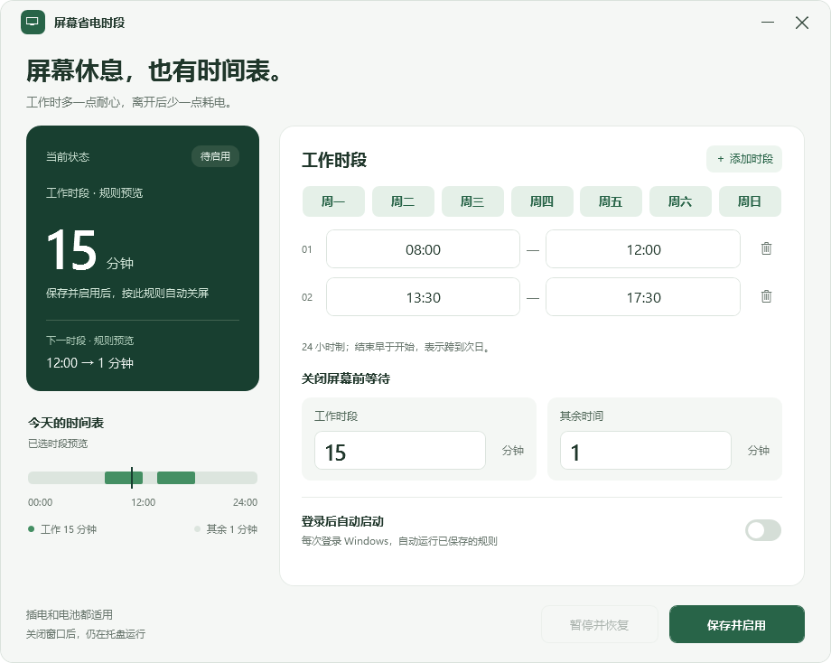

# 屏幕省电时段

一个 Windows 托盘小工具，按你的作息自动切换显示器的关屏等待时间。

**[下载最新版本](https://github.com/linyaxxx/screen-timeout-scheduler/releases/latest)** · [详细使用说明](使用说明.txt)



## 默认规则

默认每天执行，包括周六、周日。等待时间指连续没有鼠标、键盘操作的时长。

| 时间 | 无操作后关闭屏幕 |
| --- | --- |
| 08:00–12:00 | 15 分钟 |
| 13:30–17:30 | 15 分钟 |
| 其余时间，包括午休 | 1 分钟 |

时间段包含开始时间、不包含结束时间：12:00 切换到 1 分钟，13:30 切换到 15 分钟，17:30 切换到 1 分钟。

## 使用

1. 从 [Releases](https://github.com/linyaxxx/screen-timeout-scheduler/releases) 下载 `ScreenTimeoutScheduler-v1.1.0-Windows.zip`，解压到准备长期保存的位置。
2. 双击 **屏幕省电时段.exe**，按需修改时段、星期和等待分钟数。
3. 点击 **保存并启用**。首次打开只展示规则，保存并启用后才修改电源设置。
4. 如需登录后自动运行，开启 **登录后自动启动** 开关，再保存一次。

关闭窗口后程序继续在右下角托盘运行。双击托盘图标打开设置，右键可以暂停或退出。**暂停并恢复** 会停用规则并恢复接管前的关屏设置。

更新时先从托盘退出旧版，再替换程序文件。v1.1 兼容旧版配置。

## 可以调整什么

- 添加、删除和修改多个工作时段，使用 24 小时制 `HH:mm`。
- 选择工作时段适用的星期；未选中的日期使用“其余时间”规则。
- 分别设置工作时段、其余时间的等待分钟数，范围为 1–1440。
- 支持跨午夜时段。例如选择周五、22:00–02:00，会持续到周六凌晨 02:00；日期按开始的那一天计算。
- 左侧显示运行状态，时间轴预览当天的安排；未保存的修改会明确标记。
- `Ctrl+S` 保存并启用，`Esc` 收起到托盘。

## 运行方式

- 面向 Windows 10/11 桌面系统，使用 .NET Framework 和系统电源管理接口。
- 插电、电池两种状态都适用，分别备份和恢复原值。
- 约每 5 秒检查一次，时段边界后最多约 5 秒更新。休眠期间不唤醒电脑，恢复后重新判断。
- 跟随当前电源计划；暂停或退出时恢复工具修改过的计划。
- 只调整“在此时间后关闭显示”，不修改睡眠、休眠、锁屏或屏幕保护程序。
- 如果电脑设置为更早睡眠，会先进入睡眠。视频、会议或其他保持屏幕常亮的软件也可能阻止自动关屏。
- 多显示器使用 Windows 统一的关屏等待时间，不分别控制各个显示器。
- 不访问网络。公司管理策略或其他电源工具可能限制设置，界面会显示失败状态并重试。

工具需要保持运行。正常暂停、退出会恢复原值；强制结束进程或突然断电无法立即恢复，备份会保留供下次启动使用。

## 配置位置

```text
%LOCALAPPDATA%\ScreenTimeoutScheduler\
  settings.xml           规则和启用状态
  original-settings.xml  原设置的恢复备份
  activity.log           设置切换与错误日志
```

不要在程序运行或恢复失败时删除 `original-settings.xml`。暂停状态会保存；下次启动仍为暂停。

## 从源码构建

在 Windows 上使用系统的 .NET Framework C# 编译器，不需要安装 Python、Node.js 或 NuGet 包。

```powershell
powershell.exe -NoProfile -ExecutionPolicy Bypass -File .\build.ps1
```

输出为 `release\屏幕省电时段.exe`。界面由 WPF 绘制，托盘使用 Windows 原生通知图标；XAML 嵌入可执行文件。

## 验证

核心逻辑 47 项检查、界面交互与渲染 12 项检查已通过，另外完成了真实 Windows 电源设置切换与恢复验证。

```powershell
New-Item -ItemType Directory -Path .\verification -Force | Out-Null
$tool = Join-Path (Get-Location) 'release\屏幕省电时段.exe'
$report = Join-Path (Get-Location) 'verification\self-test.txt'
$data = Join-Path (Get-Location) 'verification\test-data'
Start-Process -FilePath $tool -ArgumentList @('--self-test', '--report', $report, '--data-dir', $data) -Wait
Get-Content -LiteralPath $report -Encoding UTF8
```

可用参数：

| 参数 | 用途 |
| --- | --- |
| `--self-test --report <路径> --data-dir <路径>` | 时间规则、恢复和持久化验证，不修改系统电源设置 |
| `--ui-test --report <路径> --data-dir <路径>` | 编辑、输入校验、渲染与托盘集成验证，不修改电源设置或启动项 |
| `--preview <图片路径> --data-dir <路径>` | 生成实际界面预览 |
| `--preview-scale 1.5` | 设置预览图片的像素比例 |
| `--power-test --report <路径> --data-dir <路径>` | 测试真实电源读写，结束后恢复原值 |
| `--background` | 启动后收起到托盘 |

`--power-test` 会短暂修改当前计划的关屏时间，仅在准备进行真实设备验证时运行。测试结果以报告中的 `RESULT: PASS` 或 `RESULT: FAIL` 为准。

## 项目结构

```text
src/
  AppWindow.xaml  界面样式与布局
  MainWindow.cs   界面交互、时间轴与托盘
  Core.cs         时段判断、电源接口与恢复机制
  Program.cs      入口、单实例与登录启动项
  Tests.cs        核心验证
build.ps1         构建脚本
app.manifest      Windows 应用清单
docs/screenshot.png
```

## 参考

- [Microsoft：电源管理命令](https://learn.microsoft.com/en-us/windows-hardware/design/device-experiences/powercfg-command-line-options)
- [Microsoft：PowerWriteACValueIndex](https://learn.microsoft.com/en-us/windows/win32/api/powersetting/nf-powersetting-powerwriteacvalueindex)
- [Microsoft：PowerGetActiveScheme](https://learn.microsoft.com/en-us/windows/win32/api/powersetting/nf-powersetting-powergetactivescheme)
- [Microsoft：PowerSetActiveScheme](https://learn.microsoft.com/en-us/windows/win32/api/powersetting/nf-powersetting-powersetactivescheme)
